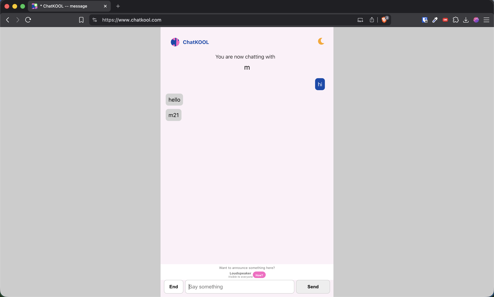
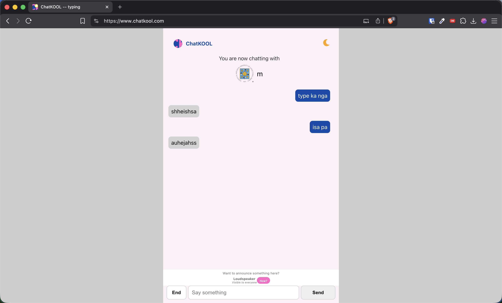
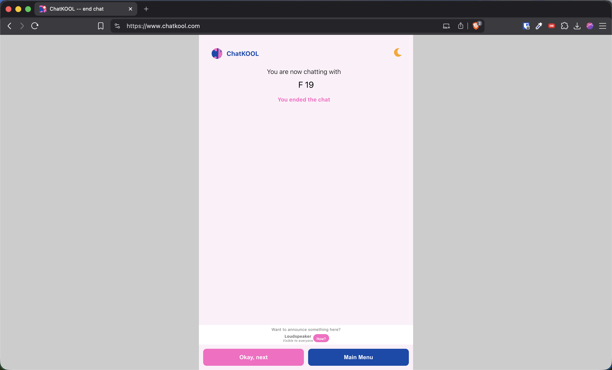

# ChatKOOL Message Notification Extension

A browser extension that provides visual notifications when someone messages you on ChatKOOL by changing the page title and favicon.

## Features

- **Message Notifications**: Changes the title to "* ChatKOOL -- message" and updates the favicon when you receive a new message
- **Typing Indicator**: Shows when the other person is typing
- **End Chat Detection**: Detects when a chat session has ended
- **Visual Feedback**: Dynamic favicon changes based on chat status

## Screenshots

### Message Notification


### Typing Indicator


### Chat Ended



## Installation

1. Clone or download this repository
2. Open your browser's extension management page:
   - Chrome: `chrome://extensions/`
   - Edge: `edge://extensions/`
3. Enable "Developer mode"
4. Click "Load unpacked" and select the extension directory

## How It Works

The extension monitors ChatKOOL chat pages and updates the browser tab's title and favicon based on:
- New incoming messages (lightgray background indicator)
- Typing indicators (SVG element detection)
- Chat end status
- Default idle state

## File Structure

```
chatkool-message-notif-extension/
├── manifest.json          # Extension configuration
├── scripts/
│   └── app.js            # Main content script
└── icons/
    ├── favicon.ico       # Default icon
    ├── favicon-message.ico   # New message icon
    ├── favicon-typing.ico    # Typing indicator icon
    └── favicon-end.ico       # Chat ended icon
```

## Permissions

This extension only runs on `https://*.chatkool.com/*` domains and requires no special permissions.

## Version

1.0.0
